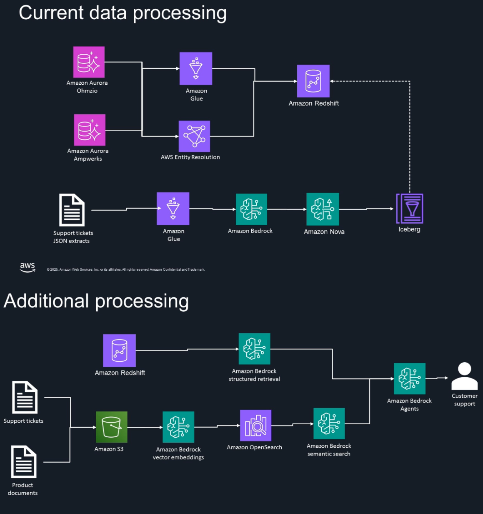

# 📘 AWS Bedrock GenAI Workshop – Hands-on Guide  

This repository documents my journey from the **AWS Data-Driven Everything workshop** on *Mastering Enterprise Gen AI: Building production applications with Amazon Bedrock*.  

Instead of just theory, this event gave me the chance to **get hands-on with Amazon Nova, Bedrock Knowledge Bases, Guardrails, Bedrock Flows, and Amazon Q**. I built working prototypes and workflows that showed me how GenAI can move from *experimentation* to *enterprise-grade production*.  

Below I summarize what I learned, in my own words.  

---

## 🚀 What I Learned  

### 🗣 Amazon Nova Models – Real-Time AI  
I worked with **Nova Sonic** (for natural speech interactions) and **Nova Act** (for agent actions in browsers via SDK). This showed me how AWS is thinking about agents not just as chatbots, but as *autonomous systems* that can take meaningful actions.  

👉 **Why this matters**: Moving from “chat” to *action* is the big leap for enterprise AI — it’s not just about answering questions, but doing real work.  

---

### 📚 Amazon Bedrock Knowledge Bases – Grounded RAG  
I built a knowledge base that combined **structured data (Redshift)** with **unstructured data (S3 + Titan embeddings + OpenSearch)**. This hybrid Retrieval-Augmented Generation (RAG) approach made it possible to ask questions in natural language and get reliable, grounded answers.  

👉 **Why this matters**: A model that isn’t grounded in your own data will hallucinate. With Bedrock Knowledge Bases, you get answers backed by your company’s actual information.  

---

### 🤖 Amazon Q – Generative AI Assistant  
I explored **Amazon Q** across different contexts: Business, Developer, Redshift, Connect, and QuickSight. I especially liked the **Generative SQL in Redshift** feature, where plain-English queries became optimized SQL automatically.  

👉 **Why this matters**: This makes data access *democratic* — no longer limited to SQL experts. Anyone in an organization can ask questions about data and get trusted answers.  

---

### 🛡 Bedrock Guardrails – Responsible AI  
I implemented guardrails to filter out harmful content, prevent hallucinations, and enforce policies around privacy and sensitive data. This was a practical reminder that **enterprise AI must always include safety and governance**.  

👉 **Why this matters**: Without guardrails, GenAI can cause risk — from misinformation to privacy leaks. Guardrails make GenAI enterprise-ready.  

---

### 🔄 Bedrock Flows – Visual Workflows  
I used **Bedrock Flows** to design multi-step workflows that classified customer queries and routed them to the right knowledge base. The drag-and-drop interface felt like designing business logic visually, while still powered by AI.  

👉 **Why this matters**: Workflows let you go beyond one-off prompts — you can design *repeatable processes* that scale across the enterprise.  

---

## 🧪 Labs  

1. [Knowledge Base with Business Data](labs/knowledge_base_setup.md)  
2. [Prompt Management, Agents, Guardrails](labs/prompt_agents_guardrails.md)  
3. [Bedrock Flows – Visual AI Pipelines](labs/bedrock_flows.md)  
4. [Generative SQL in Redshift](labs/generative_sql_redshift.md)  

---

## 🌍 Why This Repository Matters  

This repo is not just lab notes — it’s my **personal guidebook** for how to:  
- Move GenAI from demo → production.  
- Combine structured + unstructured data.  
- Use AI responsibly with safety guardrails.  
- Empower teams (not just developers) to use AI effectively.  

I hope it helps others who want to explore Amazon Bedrock, Nova, and Q in practice.  

---

## 📚 Resources  

Here are the most helpful resources I used to extend my learning beyond the workshop:  

- [Amazon Bedrock Documentation](https://docs.aws.amazon.com/bedrock/)  
- [Amazon Nova Models Overview](https://aws.amazon.com/ai/generative-ai/amazon-nova/)  
- [Amazon Q Overview](https://aws.amazon.com/q/)  
- [Generative SQL in Amazon Redshift](https://docs.aws.amazon.com/redshift/latest/mgmt/query-editor-v2-generative-ai.html)  
- [AWS Blog: Write queries faster with Amazon Q generative SQL](https://aws.amazon.com/blogs/big-data/write-queries-faster-with-amazon-q-generative-sql-for-amazon-redshift/)  
- [AWS Blog: Secure Generative SQL with Amazon Q](https://aws.amazon.com/blogs/big-data/secure-generative-sql-with-amazon-q/)  
- [Amazon Bedrock Guardrails](https://docs.aws.amazon.com/bedrock/latest/userguide/guardrails.html)  
- [Amazon Bedrock Flows](https://docs.aws.amazon.com/bedrock/latest/userguide/flows.html)  
