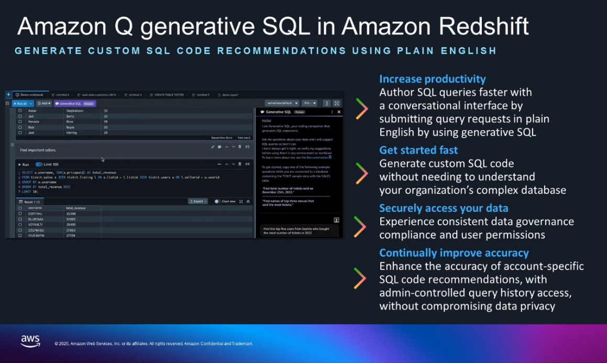

# Lab 4: Natural Language to SQL with Amazon Q Generative SQL  

## 🎯 Objective  
Use **Amazon Q Generative SQL** in Redshift to convert plain-English questions into optimized SQL queries. This lowers the barrier for non-technical users and accelerates data analysis.  

---

## 📝 What I Did  

### 1. Enabled Amazon Q Generative SQL  
- Opened **Redshift Query Editor v2**.  
- Clicked the Amazon Q icon to enable chat-style queries.  
- Required permission:  

```bash
sqlworkbench:UpdateAccountQSqlSettings
```

🔗 [Interacting with Amazon Q Generative SQL – Docs](https://docs.aws.amazon.com/redshift/latest/mgmt/query-editor-v2-generative-ai.html)  

---

### 2. Asked Questions in Plain English  
I tried natural-language queries like:  
- *“Show total sales by region last quarter.”*  
- *“List the top 10 customers by revenue.”*  

Amazon Q generated the correct SQL automatically, which I could run directly in Redshift.  

🔗 [AWS Blog: Write Queries Faster with Amazon Q Generative SQL](https://aws.amazon.com/blogs/big-data/write-queries-faster-with-amazon-q-generative-sql-for-amazon-redshift/)  

---

### 3. Practiced with Sample Data  
Using the **TICKIT dataset**, I tested different prompts. For example, asking about venues or grouping results by state. Amazon Q was able to refine and adapt the queries based on my follow-up questions. 

- Prompt: *“How many venues are there?”*  
- Generated SQL:  

```sql
SELECT COUNT(*) AS num_venues FROM tickit.venue;
```

🔗 [Tutorial: Generative SQL with TICKIT Data](https://docs.aws.amazon.com/redshift/latest/mgmt/query-editor-v2-generative-ai-example.html)  

---

### 4. Added Custom Context  
To improve accuracy, I explored using **custom context files**. These allow you to:  
- Annotate table and column names.  
- Provide curated example queries.  
- Add domain-specific hints to help the model generate better SQL.  

🔗 [Custom Context for Generative SQL](https://docs.aws.amazon.com/redshift/latest/mgmt/query-editor-v2-generative-ai.html#qe-gai-custom-context)  

---

### 5. Looked at Safety & Governance  
I noted that:  
- Amazon Q respects existing Redshift permissions.  
- Any SQL that could modify data (insert, update, delete, etc.) is flagged with a warning before execution.  

🔗 [AWS Blog: Secure Generative SQL with Amazon Q](https://aws.amazon.com/blogs/big-data/secure-generative-sql-with-amazon-q/)  

---

## ✅ Why This Helps Us  
- **For analysts** → saves time by avoiding manual SQL writing.  
- **For business users** → makes data accessible without needing SQL knowledge.  
- **For enterprises** → boosts productivity while maintaining governance and compliance.  

This transforms Redshift into a conversational, accessible data warehouse.  

---

## 📚 Resources  
- [Generative SQL in Amazon Redshift – Docs](https://docs.aws.amazon.com/redshift/latest/mgmt/query-editor-v2-generative-ai.html)  
- [AWS Blog: Write Queries Faster with Amazon Q Generative SQL](https://aws.amazon.com/blogs/big-data/write-queries-faster-with-amazon-q-generative-sql-for-amazon-redshift/)  
- [Tutorial: Generative SQL with TICKIT Data](https://docs.aws.amazon.com/redshift/latest/mgmt/query-editor-v2-generative-ai-example.html)  
- [AWS Blog: Secure Generative SQL with Amazon Q](https://aws.amazon.com/blogs/big-data/secure-generative-sql-with-amazon-q/)  
