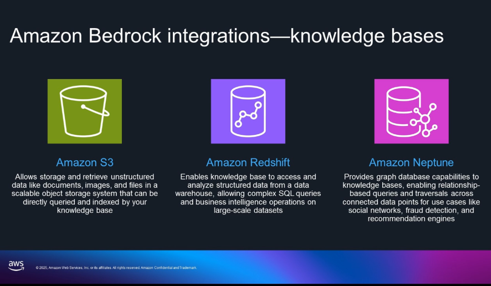

# Lab 1: Creating a Knowledge Base with Business Data  

## 🎯 Objective  
Build a hybrid knowledge base using **Amazon Bedrock** that combines structured data (Redshift) and unstructured data (S3 + Titan embeddings + OpenSearch). This setup powers Retrieval-Augmented Generation (RAG) for more accurate AI responses.  

---

## 📝 What I Did  

### 1. Enabled Bedrock Models  
- Activated **Titan Text Embeddings V2**, **Nova Pro**, and **Nova Micro**.  
- These models handled embedding, generation, and retrieval.  

---

### 2. Connected to Structured Data (Redshift)  
- Used **Amazon Redshift Serverless** for enterprise data.  
- Leveraged **Amazon Q Generative SQL** to query the warehouse with natural language.  
- Integrated Iceberg tables for support ticket analysis.  

🔗 [Amazon Redshift Documentation](https://docs.aws.amazon.com/redshift/)  

---

### 3. Built Vector Knowledge Base  
- Uploaded product docs (`.docx`) and support tickets (`.json`) into **Amazon S3**.  
- Generated embeddings using **Titan Embeddings**.  
- Stored and searched vectors in **Amazon OpenSearch Serverless**.  

🔗 [Amazon OpenSearch Service Docs](https://docs.aws.amazon.com/opensearch-service/)  

---

### 4. Combined into a RAG Architecture  
- Linked **Redshift KB** (structured queries) + **Vector KB** (semantic retrieval).  
- Configured RAG so queries could pull both factual and contextual answers.  

🔗 [Retrieval Augmented Generation Overview](https://aws.amazon.com/what-is/retrieval-augmented-generation/)  

---

## ✅ Why This Helps Us  
Knowledge bases make GenAI practical in business:  
- They ground answers in **real company data**, reducing hallucinations.  
- They unify structured + unstructured data in one place.  
- They scale easily with new docs or tickets.  

---

## 📚 Resources  
- [Amazon Bedrock Knowledge Bases](https://docs.aws.amazon.com/bedrock/latest/userguide/knowledge-base.html)  
- [Amazon Titan Embeddings](https://aws.amazon.com/bedrock/titan/)  
- [Amazon Redshift](https://docs.aws.amazon.com/redshift/)  
- [Amazon OpenSearch](https://docs.aws.amazon.com/opensearch-service/)  

